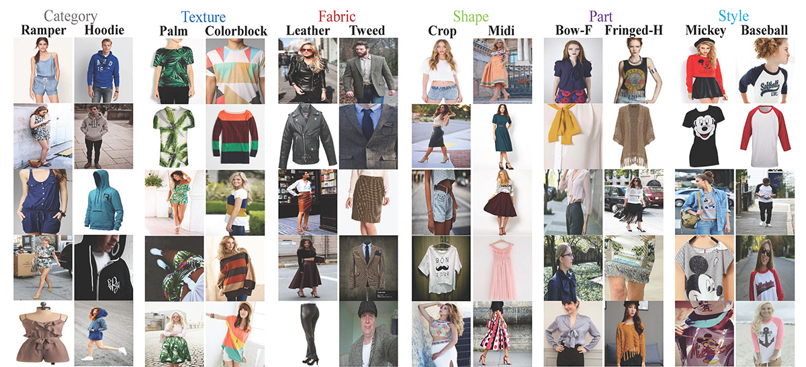
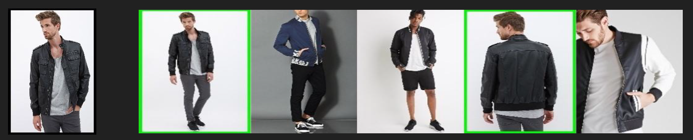

# Fashion Recommendation

In this project, I create an end-to-end solution for large-scale clothing retrieval and visual recommendation on fashion images. More specifically, my system can learn the important regions in an image and generate diverse recommendations based on such semantic similarity.  

First, I built a clothing image classification model using a ResNet-based model. The feature layer of this model can capture fine-grained semantic clothing features like fabrics, styles and patterns of the clothes. Then, using such features, the model can recommend similar clothes to the input images using nearest neighbor search.

## Dataset
[DeepFashion](http://mmlab.ie.cuhk.edu.hk/projects/DeepFashion.html) is a large-scale clothes database that is quite popular in the research community. It contains over 800,000 diverse fashion images ranging from well-posed shop images to unconstrained consumer photos. It is annotated with rich information of clothing items. It also contains over 300,000 cross-pose/cross-domain image pairs.

More specifically, I used the images in the [DeepFashion Attribute Prediction](http://mmlab.ie.cuhk.edu.hk/projects/DeepFashion/AttributePrediction.html) subset. It contains 289,222 number of clothes images, 50 number of clothing categories, and 1,000 number of clothing attributes. Each image is annotated by bounding box and clothing type.

## Code
1. [preprocessing.py](https://github.com/khanhnamle1994/fashion-recommendation/blob/master/code/preprocessing.py): This code is used to pre-process the dataset.
2. [hyper_parameters.py](https://github.com/khanhnamle1994/fashion-recommendation/blob/master/code/hyper_parameters.py): This code is used to define all hyper-parameters regarding training.
3. [fashion_input.py](https://github.com/khanhnamle1994/fashion-recommendation/blob/master/code/fashion_input.py): This code is used to pre-process the image further during training.
4. [simple_resnet.py](https://github.com/khanhnamle1994/fashion-recommendation/blob/master/code/simple_resnet.py): This code is used to define ResNet architecture.
5. [train_n_test.py](https://github.com/khanhnamle1994/fashion-recommendation/blob/master/code/train_n_test.py): This code is used as the main training file.

## Sample Results

1 - Romper Category

2 - Jacket Category

3 - Blouse Shirt Category

## Requirements
- [TensorFlow](https://www.tensorflow.org/) latest version
- [pandas](https://pandas.pydata.org/) latest version
- [numpy](http://www.numpy.org/) latest version
